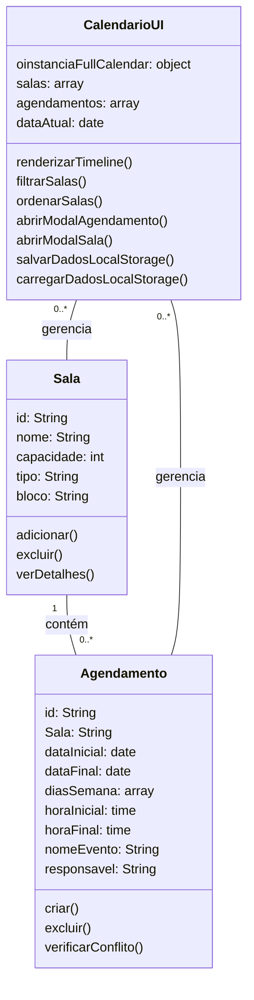

```
classDiagram
    class Sala {
        id: String
        nome: String
        capacidade: int
        tipo: String
        bloco: String
        adicionar()
        excluir()
        verDetalhes()
    }

    class Agendamento {
        id: String
        Sala: String
        dataInicial: date
        dataFinal: date
        diasSemana: array
        horaInicial: time
        horaFinal: time
        nomeEvento: String
        responsavel: String
        criar()
        excluir()
        verificarConflito()
    }

    class CalendarioUI {
        oinstanciaFullCalendar: object
        salas: array
        agendamentos: array
        dataAtual: date
        renderizarTimeline()
        filtrarSalas()
        ordenarSalas()
        abrirModalAgendamento()
        abrirModalSala()
        salvarDadosLocalStorage()
        carregarDadosLocalStorage()
    }

    Sala "1" -- "0..*" Agendamento : contém
    CalendarioUI "0..*" -- Sala : gerencia
    CalendarioUI "0..*" -- Agendamento : gerencia
```

