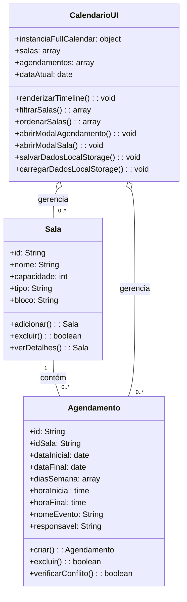

```
classDiagram
    class Sala {
        +id: String
        +nome: String
        +capacidade: int
        +tipo: String
        +bloco: String
        +adicionar(): Sala
        +excluir(): boolean
        +verDetalhes(): Sala
    }

    class Agendamento {
        +id: String
        +idSala: String
        +dataInicial: date
        +dataFinal: date
        +diasSemana: array
        +horaInicial: time
        +horaFinal: time
        +nomeEvento: String
        +responsavel: String
        +criar(): Agendamento
        +excluir(): boolean
        +verificarConflito(): boolean
    }

    class CalendarioUI {
        +instanciaFullCalendar: object
        +salas: array
        +agendamentos: array
        +dataAtual: date
        +renderizarTimeline(): void
        +filtrarSalas(): array
        +ordenarSalas(): array
        +abrirModalAgendamento(): void
        +abrirModalSala(): void
        +salvarDadosLocalStorage(): void
        +carregarDadosLocalStorage(): void
    }

    Sala "1" -- "0..*" Agendamento : contém
    CalendarioUI o-- "0..*" Sala : gerencia
    CalendarioUI o-- "0..*" Agendamento : gerencia
```

